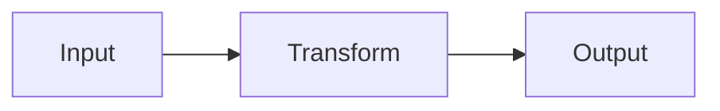

### Summary
<!-- 1-3 sentences: what experiment/change this PR is, and why.
     Add whatever helps a reader understand fastest and drop what doesn't
     apply — a flow/architecture diagram, a before/after snippet, a
     formula. These are tools, not a checklist. -->

<!-- Diagram, e.g. architecture or flow:

-->

<!-- Before vs. after:
**Before**
```python
def old(): ...
```
**After**
```python
def new(): ...
```
-->

<!-- Formula, e.g. for a math-flavored experiment:
$$ P(X_{t+1} = j \mid X_t = i) = P_{ij} $$
-->

### Hypothesis
<!-- What you expected going in — the question this experiment was testing,
     or the thing you thought would work. Ties back to NOTES.md's "Goal". -->

### Learnings
<!-- What actually happened: what worked, what surprised you, what you'd
     do differently next time. A representative code snippet showing the
     key result is often worth more here than prose. -->
-
-

### Testing
<!-- Checklist of what to verify before merging. -->
- [ ]
