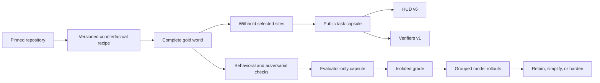

# Parallax: hard tasks from familiar repositories

Parallax is an experiment in compiling public or private repositories into
fresh, executable coding-agent tasks. It does not mine old issues and call
them novel. A pinned repository supplies realistic architecture and tooling;
a recipe adds a counterfactual contract that never existed upstream, creates
a complete gold world, then withholds selected implementation sites from the
starter world. Hidden behavioral checks grade the result without requiring
the agent to reproduce a gold diff.

## Objective

Test whether counterfactual contracts can extract useful training signal from
repositories that models may already know, while keeping generation
deterministic, rewards difficult to game, and task records portable across HUD
v6 and Prime Intellect Verifiers v1.

## Hypotheses

1. Restoring memorized upstream code will fail tasks whose target behavior was
   synthesized after the pinned revision.
2. Cross-cutting omissions around a new contract require more repository
   understanding than isolated syntax mutations.
3. A hard gate on counterfactual behavior and integrity, plus separately
   reported regression and adversarial checks, produces better signal than a
   flat test-pass fraction.
4. Live grouped rollouts are necessary to distinguish useful difficulty from
   broken environments and impossible tasks.

## Pipeline



The public capsule contains only a source locator, pinned revision, prompt,
starter patch, behavior tags, and artifact hashes. The sealed capsule contains
the full recipe, gold patch, and admission evidence. Repository source is never
copied into this experiment.

## Current vertical slice

The first recipe family targets the heavily used
[Click](https://github.com/pallets/click) repository. It creates 12 names for a
new `CliRunner` capture policy. The policy must choose file-descriptor capture
on POSIX and safe Python-stream capture on Windows while preserving output
ordering and old modes. Different recipes expose the declaration but omit one
to three implementation sites. The behavior did not exist in upstream Click,
so restoring source from GitHub cannot satisfy the grader.

This is a deliberately narrow first family. It proves deterministic
compilation, gold/starter admission checks, no-op rejection, component rewards,
and both platform exports before attempting automatic semantic transforms
across languages.

## Quick start

```bash
uv sync
uv run pytest
uv run ruff check .

python recipes/build_click_portable.py
uv run parallax compile \
  recipes/click/00-portable.json \
  /path/to/pinned/click \
  --out runs
```

The report will be completed after live HUD calibration. Working evidence and
failed attempts are recorded in [NOTES.md](NOTES.md).
