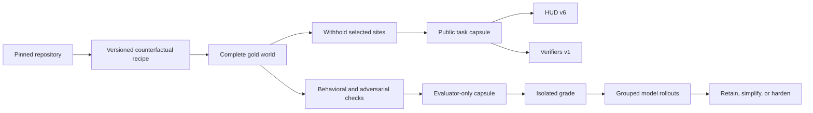

# Parallax: hard tasks from familiar repositories

Parallax is an experiment in compiling public or private repositories into
fresh, executable coding-agent tasks. It does not mine old issues and call
them novel. A pinned repository supplies realistic architecture and tooling;
a recipe adds a counterfactual contract that never existed upstream, creates
a complete gold world, then withholds selected implementation sites from the
starter world. Hidden behavioral checks grade the result without requiring
the agent to reproduce a gold diff.

## Objective

Test whether counterfactual contracts can extract useful training signal from
repositories that models may already know, while keeping generation
deterministic, rewards difficult to game, and task records portable across HUD
v6 and Prime Intellect Verifiers v1.

## Hypotheses

1. Restoring memorized upstream code will fail tasks whose target behavior was
   synthesized after the pinned revision.
2. Cross-cutting omissions around a new contract require more repository
   understanding than isolated syntax mutations.
3. A hard gate on counterfactual behavior and integrity, plus separately
   reported regression and adversarial checks, produces better signal than a
   flat test-pass fraction.
4. Live grouped rollouts are necessary to distinguish useful difficulty from
   broken environments and impossible tasks.

## Pipeline



The public capsule contains only a source locator, pinned revision, prompt,
starter patch, behavior tags, and artifact hashes. The sealed capsule contains
the full recipe, gold patch, and admission evidence. Repository source is never
copied into this experiment.

## What value remains in a scraped repository

A familiar repository is useful as a distribution of real constraints, not as
a source of old answers. Its dependency graph, compatibility commitments,
build system, state ownership, serialization formats, error conventions, and
tests form a substrate. Parallax derives a new target world from that substrate:

1. Add a behavior absent from upstream. Renaming an old issue is not enough.
2. Compose the behavior across existing architectural seams.
3. Create the complete implementation before writing the task.
4. Derive behavioral, metamorphic, and adversarial probes from the complete
   world.
5. Remove related implementation sites to produce the starter.
6. Rebuild a one-commit repository with no remote, future history, gold patch,
   or hidden tests.
7. Reject the task if upstream restoration, no-op, hardcoding, test tampering,
   or plausible semantic mutants receive reward.
8. Calibrate with named model and harness revisions. Difficulty is an observed
   distribution, not an AST metric.

This also works for private repositories. Credentials belong only in intake;
committed manifests should contain an opaque source ID and content digest.
Source, hidden tests, gold patches, and secrets must not enter model-visible
images or trace telemetry.

## What makes a good RL environment

The experiment found seven separate admission questions:

- **Validity:** does gold pass, does starter fail, and are repeated grades
  deterministic?
- **Discriminativeness:** do probes reject multiple plausible wrong solutions,
  not just the starter?
- **Learnability:** do strong models make nonzero progress, rather than all
  runs failing on setup or missing information?
- **Headroom:** do frontier models remain below saturation under a fixed
  scaffold and budget?
- **Isolation:** can the agent reach the gold, grader, network, host filesystem,
  or future git history?
- **Reward integrity:** are outcome, regression, adversarial, process, and
  efficiency signals reported separately? Can one compensate for tampering?
- **Behavioral value:** does the trajectory show repository grounding, scoped
  changes, failure-responsive recovery, test integrity, and fresh verification?

Executable outcome should remain the primary reward. Integrity violations are
hard gates. Process behavior is useful as a separately calibrated trace label,
not an unvalidated bonus that can reward performative tool use.

## Research baseline

The design draws on primary results rather than leaderboard folklore:

- The [connected research knowledge base](knowledge/index.md) stores typed
  source, concept, and synthesis notes with validated semantic links. The
  [long-form RL environment synthesis](RL_ENVIRONMENT_KNOWLEDGE_BASE.md)
  remains a readable snapshot of the July 2026 review.
- [SWE-Smith](https://arxiv.org/abs/2504.21798) generated 50,137 tasks from 128
  repositories. Claude 3.7 solved 36% overall, but the median task changed only
  five lines; PR-mirror trajectories transferred best.
- [SWE-rebench](https://arxiv.org/abs/2505.20411) continuously collects fresh
  issues. In its 2025 analysis, one model fell from 28.6% on one-file tasks to
  17.5% on tasks changing three or more files.
- [SWE-bench Live](https://arxiv.org/abs/2505.23419) reported less than 10%
  resolution for tasks over 100 changed lines or three files, and 0% at seven
  or more files in its initial study.
- [SWE-Mutation](https://aclanthology.org/2026.findings-acl.1976/) reduced
  average mutant detection from 71.04% to 39.81% with agentic semantic
  mutations. A gold-passing test suite is not necessarily discriminative.
- Cursor's
  [strict benchmark rerun](https://cursor.com/blog/reward-hacking-coding-benchmarks)
  found upstream lookup in 57% of reviewed Opus 4.8 trajectories. Removing
  retrieval paths reduced two agents by 14.1 and 20.7 percentage points.
- [Agent Behavior](https://www.agentbehavior.dev/) supplies a useful format for
  stating recurring conduct separately from task prompts and outcome graders.

Headline rates are not directly comparable: harness, budget, pass@k, repository
mix, model snapshot, and invalid-task filtering differ. They support design
choices, not a universal difficulty threshold.

## Experiment: Click counterfactual capture

The first family targets the heavily used
[Click](https://github.com/pallets/click) repository at
`00e592cea702e0b2caa0dee42489fdb1c22cd845`. Twelve recipes add a new
`CliRunner` capture policy that selects file-descriptor capture on POSIX and
Python-stream capture on Windows. Each seed exposes a declaration and withholds
one to three implementation sites. The behavior never existed upstream, and
restoring upstream scores zero.

The 12-task admission matrix passed twice:

| Check | Result |
| --- | ---: |
| Deterministic task and starter digests | 12/12 |
| Gold receives reward 1 | 12/12 |
| No-op receives reward 0 | 12/12 |
| Upstream restoration receives reward 0 | 12/12 |
| Forbidden unrelated path receives reward 0 | 12/12 |

See [admission.json](results/admission.json) for per-task components.

## Live HUD results

The live result is a useful rejection, not a benchmark win:

- GPT-5.6 Sol passed all semantic checks in 4/4 audited completed rollouts.
  Three received reward 1. The fourth received zero only because it added good
  focused tests, which the original path policy forbade.
- Three representative DeepSeek-V4-Flash traces also passed every semantic
  component. All received zero because they added tests; two also wrote normal
  pip cache files under the workspace.
- The reward policy was wrong. It selected for the smallest patch against
  normal engineering behavior. The corrected recipes allow the relevant test
  file and ignore narrowly defined cache artifacts while still rejecting
  unrelated paths.
- The family is semantically saturated and is therefore rejected by the
  curriculum controller. Novel tokens and omitted dispatch logic defeat
  memorization but do not make a hard task.

The exact jobs and audited counts are in
[live-calibration.json](results/live-calibration.json).

### Harness and containment findings

Local HUD 0.6.12 on macOS warned that bubblewrap was unavailable. Agents then
searched the host filesystem; one modified the separate pinned Click clone.
The diff is preserved in
[escaped-workspace-click.diff](results/escaped-workspace-click.diff). These
runs are useful for grader and behavior analysis but are not acceptable
production isolation.

The environment image built, started, and passed HUD v6 introspection, but
runtime-tunnel provisioning returned HTTP 404 for 12 attempted rollouts.
Fully hosted submission then reported that no environment registry existed.
Those are platform errors, not zero-reward model runs.

## Decision and next family

The original claim “counterfactual contracts will be hard” was too broad.
Counterfactuality addresses contamination, not depth. The next admitted family
must combine:

1. state propagated across at least three architectural layers;
2. sequence- or timing-dependent behavior under a deterministic clock;
3. hidden metamorphic variants generated from the gold world;
4. a secret pool of plausible semantic mutants;
5. fewer implementation-shaped clues;
6. container-only execution with deny-by-default egress;
7. repeated strong-model success between roughly 5% and 40%.

Failures caused by setup, import contamination, provider timeout, or
containment count against the harness, never against the model. A recursive
loop in `parallax.calibration` emits `repair_harness`, `simplify`, `retain`, or
`harden`; for this family it emits `harden`.

## Platform contracts

- **HUD v6:** `hud_env/env.py` exposes the `repair` async-generator template,
  a network-disabled tracked workspace, a one-commit source checkout, and a
  structured `EvaluationResult`. `hud_env/tasks.json` contains 12 bound tasks.
- **Prime Intellect Verifiers v1:** `exports/verifiers/taskset.py` uses
  `verifiers.v1`, typed `TaskData`/`Task`, runtime setup, and evaluator-side
  reward execution. `tasks.jsonl` contains only public task fields. The
  experiment pins the current v1 development revision because PyPI 0.2.1 does
  not expose the v1 namespace.

Neither adapter places a gold patch or hidden probe in public task data. A
production evaluator image must provide the `parallax-evaluator` command used
by the Verifiers package.

## Quick start

```bash
uv sync
uv run pytest
uv run ruff check .

python recipes/build_click_portable.py
uv run parallax compile \
  recipes/click/00-portable.json \
  /path/to/pinned/click \
  --out runs

uv run python scripts/admit.py \
  recipes/click /path/to/pinned/click \
  --out results/admission.json

# Optional integrations.
uv sync --extra verifiers
PYTHONPATH=exports/verifiers uv run python -c \
  'import taskset, verifiers.v1 as vf; print(len(list(taskset.RepoTaskset(vf.TasksetConfig()))))'

cd hud_env
uv sync
hud task list --source tasks.py
```

Working evidence and failed attempts are recorded in
[NOTES.md](NOTES.md). The experiment intentionally contains no fetched
repository source.

## Limitations

- The implemented transform is recipe-driven and Python-specific. General
  semantic discovery across languages is future work.
- Only one repository and one task family received live calibration.
- Three DeepSeek traces and four GPT traces received detailed semantic review;
  aggregate zero rewards under the old scope gate must not be read as zero
  semantic success.
- No Prime sandbox rollout was purchased. The v1 taskset loads against the
  pinned API, but its evaluator command was validated only as a packaging
  contract.
- The live sample is too small for confidence intervals or model ranking. It
  was enough to reject a saturated family and expose two harness defects.
