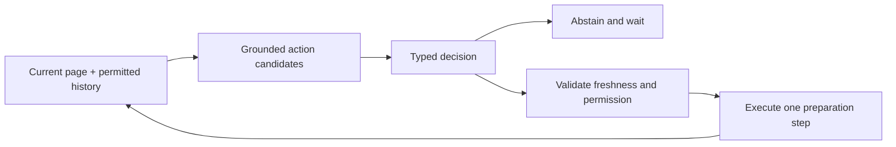

# Browser next-action prediction

Add a next-wave Jev experiment that anticipates the user's next browser step from the current page and recent session history. The first proposed flow preserves an email draft while preparing a flight search in another tab. Learned abstention, complete action correctness and useful task completion are the research questions.

This folder contains a researched proposal, not a trained model or working browser extension. The [decision ticket](decision.md) records the design, dependencies, comparisons and open questions. The [implementation checklist](IMPLEMENTATION.md) keeps future delivery separate from those decisions.



The experiment starts with recorded examples and resettable synthetic fixtures. It then compares hosted Jev and local readouts under the same candidate and execution policies, including threshold-based and learned abstention. A later private browser pilot depends on measured risk and coverage, draft preservation, cancellation and explicit control of automatic preparation. Every step observes the page again; a successful next-click prediction is only one part of the evaluation.

## Sources and credit

The motivating reference is [Composite Engineering Team's next-action study](https://research.composite.com/next-action). Read the [source check](composite-analysis.md) for its reported evidence and limits. Yonatan Geifman and Ran El-Yaniv's [SelectiveNet](https://proceedings.mlr.press/v97/geifman19a.html) informs the rejection comparison. The OSU NLP Group and [Mind2Web paper authors](https://github.com/OSU-NLP-Group/Mind2Web) provide a possible secondary dataset, subject to a separately labeled instruction-removed transformation.

[Source metadata](source-index.json) records URLs, credits, retrieval hashes and the inspected repository revision. No upstream code, model weights, dataset rows or full page copies are included. The proposed runtime design and protocol are authored here; they have not been validated by those projects.

## Roadmap and verification

The new entry belongs in [the release map](../roadmap/MAP.md) under later named decisions. It depends on the private extension, typed runtime and action-grounding work. It does not add a first-release gate. Existing-file changes are delivered as [roadmap-update.patch](roadmap-update.patch), whose ordered prerequisites and before/after hashes are in [patch-manifest.json](patch-manifest.json).

Run from the repository root:

```sh
python3 jev-experiments/browser-next-action-2026-09-22/verify.py
```

The verifier reconstructs the map from the recorded base and prerequisite patches, applies this incremental patch, verifies its content hashes and checks local document links and source metadata. [Verification output](verification.json) reports those checks. It does not measure browser behavior, model quality, latency or training results. [NOTES.md](NOTES.md) records the investigation; [CONTEXT.md](CONTEXT.md) defines the evaluation terms.
