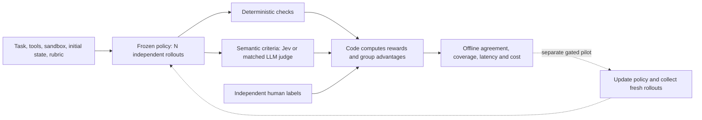

# Six next-wave experiments

These studies turn the requested projects and RL-grading idea into named experiments with explicit questions, owners, dependencies and proposed evaluations. They add work to the [release map](../roadmap/MAP.md); they do not expand the first-release gate or add unfinished catalog entries. No models were installed, provider calls made, or training run for this research.

| Experiment | Precedent and credit | What it should establish |
| --- | --- | --- |
| [Local email specialist](decisions/jimothy-experiment.md) | [Jimothy](https://github.com/andrewprifer/jimothy), Andrew Prifer; [public demo](https://jimothy-r63s.vercel.app) | Whether a small fixed-task classifier can make useful local suggestions at a frozen review threshold. |
| [Decisions with a review threshold](decisions/autojev-experiment.md) | [AutoJev](https://github.com/denis-pplx/autojev), Denis Yarats | Coverage, calibration and task quality from an explicitly identified self-hosted typed readout. |
| [Evidence selection lab](decisions/webctl-experiment.md) | [webctl](https://github.com/dorkitude/webctl), Kyle Wild | Whether selecting passages reduces total cost while preserving necessary evidence and final-answer quality. |
| [Workflow trace lab](decisions/workflow-builder-experiment.md) | [Jev Workflow Builder](https://github.com/ctnicholas/jev-workflow-builder), Chris Nicholas | Whether editable typed branches improve a small workflow, with immutable traces and independent task checks. |
| [Recruiting evidence comparison](decisions/recruiter-experiment.md) | [Jev Recruiter](https://github.com/skeptrunedev/jev-recruiter), skeptrune / skeptrunedev; upstream Browser Use | Whether SGLang token scoring and non-thinking DeepSeek generation agree on bounded, human-reviewed evidence questions, and at what total cost. |
| [Rubric replay for GRPO](decisions/rl-rubric-grader.md) | User-proposed Jev grading loop; [DeepSeekMath](https://arxiv.org/html/2402.03300v3#S4) and [Rubrics as Rewards](https://arxiv.org/html/2507.17746v2#S2) | Whether typed pass/fail checks preserve reward ranking and advantages before they are used to train a policy. |

## Findings that change the design

[Jimothy](jimothy-analysis.md) fits one task's readout over frozen features. Its email example measures agreement with a teacher, and singleton versus batched predictions differ. The experiment therefore needs independent labels, runtime parity and an explicit abstention policy. It is separate from general-model adaptation.

[AutoJev](autojev-analysis.md) exposes a 27B trained readout and an inspectable server. Its headline micro-accuracy comparison uses a monitored validation panel that influenced checkpoint selection; equal weighting of suites reverses the ordering. The proposed comparison begins with text decisions and measured calibration. It neither replaces the installed Mac model nor inherits a natural-image quality claim.

[webctl](webctl-analysis.md) already uses Jev to score search results and filter extracted passages. Its MCP integration is a provider client, not the host-facing toolkit server we need. Preserve dropped and unjudged evidence, compare matched retrieval inputs, and include selector and downstream answer costs. A smaller payload alone is not a successful answer.

[Workflow Builder](workflow-builder-analysis.md) combines React Flow, typed decisions, streaming generation and multiplayer state. Start our experiment with a recorded, single-user graph using existing dependencies. Freeze each run's graph and inputs. Hosted collaboration has separate authentication, concurrency and persistence requirements.

[Recruiter and endpoint research](recruiter-analysis.md) confirms a supported DeepSeek V4.1 non-thinking path. Its reference encoder already inserts `</think>` at the assistant boundary. SGLang's `/v1/score` accepts query/items and label token IDs, with zero generated tokens; it does not apply the chat template or accept thinking controls. Exact V4.1 scoring compatibility is unmeasured. Tokenization and one-step-logprob parity must pass before a speed comparison. The initial application uses synthetic evidence, with human review and no automated employment decisions.

[RL grading](rl-grader-analysis.md) should begin with immutable rollout groups and independently adjudicated criterion labels. A small judge error can change the sign of a group-relative advantage even when overall classification accuracy looks good. The existing judge and reward experiments provide reusable records and diagnostics, but they are not already GRPO evidence.



For `T` updates, `B` prompts, `N` rollouts and `M_s` semantic criteria, grading work grows with `T × B × N × M_s`. Lower per-check cost could matter a great deal, but this is not exponential scaling. Measure whole-group and training-step latency, caches, retries, orchestration and independent policy quality. A cost claim about offline grading is not a measured speedup of training.

## Delivery and verification

[IMPLEMENTATION.md](IMPLEMENTATION.md) keeps checklists separate from decision tickets. Suggested corpus sizes and budgets are proposed bounds, not frozen protocols or completed results. Each ticket must pass its protocol review before paid evaluation or a training pilot. Source revisions, attribution and license observations are retained in the individual analyses; no upstream code, model weights or full repository copies are included.

The [roadmap patch](roadmap-update.patch) adds these six decisions after the image-search map update. [Patch metadata](patch-manifest.json) records the full prerequisite chain and before/after hashes. Run the provider-free integrity check from the repository root:

```sh
python3 jev-experiments/jev-tools-and-rl-2026-09-22/verify.py
```

It verifies authored links, pinned source metadata and the map patch against a clean base. The [verification record](verification.json) reports those checks. It does not claim that any proposed model, integration or RL study has run. The [image-search implementation](../semantic-image-field-2026-09-21/README.md) is a separate delivery with its own application patch and browser evidence.
