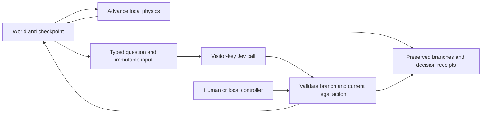

## Problem

The existing experiments often stopped at short recorded traces or displayed decisions without preserving the exact input that produced them. Visitors could not play a continuous game, compare branches from one moment, or distinguish model decisions from local assistance. The judgment gallery also lacked a complete repeated study of order and scoring effects.

## Solution

- `live-worlds/` adds complete Tetris, synchronized courtyard branches and Ghost Brush. Play, pause, scrub, take over and restore preserved runs. The assisted Tetris lane defaults to a configurable 700ms grace period before fallback; gravity continues during requests.
- `music-arranger-v2/`, `cafe-jev/` and the app components improve score editing/audio/MIDI, menu constraints, paste transactions and streamed UI. New `visual-search/`, `wardrobe-lab/`, `icon-studio/` and `outcome-framing/` experiments preserve recorded evidence and explicit limitations.
- `judgment-reliability/` completes all 620 released JudgeBench pairs, three unchanged passes and 14,880 decisions. `clustering.ts` documents an analysis correction: missing source IDs previously combined unrelated questions. The corrected 528 groups change uncertainty intervals while preserving frozen source, requests, answers and accuracy counts. The earliest 266 outputs have normalized records but lack duplicate native-batch answer maps; that coverage is disclosed.
- `quality-and-simulation-review/` contains 33 dedicated baseline audits and 160 findings. These are review findings, not a claim that every defect has been repaired. Browser/API paths use visitor keys; local recording credentials stay outside their imports.

> [!NOTE]
> The diff includes the individual audits, original probes, JSONL evidence and selected screenshots. Start with `live-worlds/README.md` and `quality-and-simulation-review/README.md`; subfolder reports describe protocols and results. No fetched repository or model weights are vendored.

## Continuous control and replay



Local timing demos, recorded responses, live responses and human actions have separate attribution. All 25 earlier recorded Jev Tetris framing runs cleared zero lines; that evidence remains visible. Live Tetris skill is not established by the working local controller. Older Snake, Orbital and Key & Door still need complete-game implementations.

## Testing

```sh
bun jev-experiments/judgment-reliability/verify.ts --complete
cd jev-experiments/experience-prototypes
bun run test
bun run build
```

The app suite passes 171 tests with 148,066 assertions across 28 files. It covers game rules, exact checkpoint restoration, delayed/cancelled answers, immutable receipts, asynchronous paste/UI state and credential isolation. JudgeBench checks cover all planned IDs, byte-exact candidates and request hashes, official scoring, ties, repeat variation, corrected question grouping and unchanged headline counts. TypeScript and the production build pass.

| Check | Observed result |
| --- | --- |
| Full JudgeBench | 7,440/7,440 evaluations; 14,880/14,880 decisions |
| Pass 1 official two-order accuracy | 411/620, 66.29% |
| Cross-order winner disagreement | 104/620, 16.77%; includes run-to-run variation |
| Pairwise repeat identity changes | 53/1,240 complete three-pass sets |
| Production interactions | Continuous play, synchronized clocks, rewind/restoration and 390px layouts passed |
| API boundaries and media | Missing-key/fixed-model checks passed; recorded video hashes, finite duration and seeking verified |

The bounded literal-credential scan found no matches in changed source or built assets; new binaries are below 2MB. This is not a comprehensive penetration test.

Play [Tetris](https://jev-experiments.vercel.app/#experiment/tetris), [the courtyard](https://jev-experiments.vercel.app/#experiment/crowd) or [Ghost Brush](https://jev-experiments.vercel.app/#experiment/ghost-brush). Read the [33-experiment review](https://jev-experiments.vercel.app/research/quality-review/review.html). Vercel root remains `jev-experiments/experience-prototypes`, with Bun and outside-root source access enabled.
