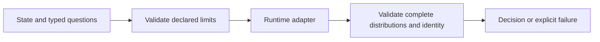

### Summary

Hosted and local decisions need the same checked question and probability format. This adds a shared typed contract with declared limits, execution identity, explicit unsupported/error results and cancellation that cannot turn into a late success.

This is the first review slice. Existing gateway and TypeScript adapter corrections are stored in `runtime/existing-contracts.patch`, following the repository's research-folder convention. The final application patch includes those corrections too; the patches are alternatives for clean source, not successive migrations.

<pr-train-toc>

- Typed runtime: pending root links, current PR
- Routing and client integration: pending root links
- Local study and Mac toolkit: pending root links
- Playable scenes and design research: pending root links
- Application and release evidence: pending root links

</pr-train-toc>

### Hypothesis

A small runtime boundary can support routing and local inference while keeping their execution and selection policies separate.

### Learnings

The existing implementations accepted inherited choice keys, numeric values for string choices and incomplete score distributions. The new regressions also exposed malformed outer requests, lost ordinal precision, mismatched revisions and late provider success after cancellation. The corrected contract never truncates requests to fit a runtime.

### Testing

- [x] `python3 jev-experiments/roadmap/runtime/verify-standalone.py`: clean Git source, patch preflight/application, locked adapter dependency installation, 17 provider-free tests and 50 assertions.
- [x] Tests include runtimes that ignore cancellation and providers returning malformed envelopes. No model provider was called.
- [x] The assembled runtime slice passed the same standalone verifier against clean GitHub main `eb3c18d6db28`, with 17 tests and 50 assertions. This artifact PR does not install the later CI workflow or deploy the app.
