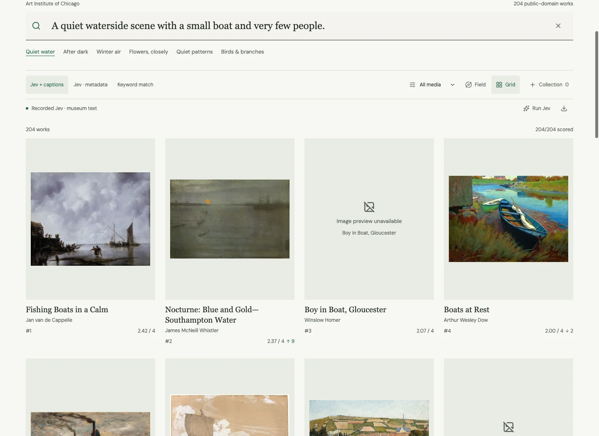

# A more useful artwork browser

The existing 204-work archive now has a larger-image grid, an optional ranked field, keyboard and touch exploration, an artwork inspector and saved collections. Typing updates the local keyword search. Saved Jev comparisons remain available, and live ranking is an explicit action with the reader's key. This is an implemented and verified local change, delivered as authored modules plus an [application patch](application.patch) under the repository's investigation rules. The patch has not been applied to GitHub main or the public application.



## What changed

The grid keeps image, title, artist, score and the caption-vs-metadata rank change together. The field places rank bands in square rings and supports mouse drag, arrow-key movement, Page Up / Page Down in rank order, zoom and reset. On touch screens it allows page scrolling until Move field is enabled. Overview renders every visible work, without an artificial result cap. It is a display of text rankings, not a map of image embeddings.

Open a work to inspect museum text, compare all three rankings, navigate adjacent results and collect it. Collections hold up to twelve works and export a versioned JSON artifact with the query, method, score, rank and source records. Imports validate IDs, uniqueness, capacity, evidence states and collection identity; descriptions and URLs come from the canonical archive. Invalid files preserve the current collection. Reopening a collected work uses its saved query context.

Ranking exports always include all 204 works, including unavailable scores and ties. Recorded, live, deterministic keyword and not-run states remain distinct. A live attempt preserves a saved query's original results; Use recorded restores that baseline. Request cancellation prevents late answers after editing or stopping. No new inference provider, dependency or model download was added.

## Reference and design review

[Semantic Image Field](https://huggingface.co/spaces/webml-community/semantic-image-field) is Joshua Lochner / Xenova and webml-community's CLIP-based photograph search. Its README credits Shridhar Rathi's animated image search and Hugging Face's Transformers.js example. The [pinned source analysis](reference-analysis.md) distinguishes that pipeline from this archive's Jev judgments over museum text. Our layout and interaction code are original; upstream source, weights and image databases are not vendored.

The [decision](decision.md), [Fable 5.1 review](fable-feedback.md) and [dispositions](review-dispositions.md) record the design choices. The first field prototype was too card-heavy to justify being the default. The revision restores the grid, reduces field framing, fixes mobile scrolling and keeps the useful camera controls as an alternative. [Capture metadata](captures.json) identifies final states, earlier review images and the attributed reference screenshot.

## Verification

- **55 Bun tests / 1,436 assertions** pass across collection validation, geometry and existing search behavior. The application's test command now includes the new tests.
- A separate clean checkout with only this application patch passed `bun install --frozen-lockfile` and `bun run build`. React type resolution and bundler deduplication let the canonical app consume the authored modules outside its root. No sibling dependency installation was required.
- All **2,448 recorded scores** remain complete across 204 works, six queries and two Jev conditions. The collection/protocol hashes remain unchanged.
- Chromium checks cover default grid, full-ranking export, field navigation, focus return, collection round-trip, invalid-file recovery, saved query context, filtering during an intercepted live request, cancellation and restoring recorded results.
- At 390 × 844, no horizontal overflow was observed. Dark mode, reduced motion, sticky dialog controls, native vertical touch scrolling and explicit pinch mode were exercised. The final overview rendered 190 visible/overscan works. A single 60-step desktop pan at45% zoom sampled89 frames, with p50 8.3ms and p95 10.2ms; this is not a cross-device performance guarantee.

The [verification record](verification.json) separates completed checks from limits. Browser emulation is not a physical-phone or screen-reader audit. Some museum previews still fail upstream; the title, ranking and source link remain available. This change makes no retrieval-accuracy, model-speed or savings claim. A pixel-based CLIP comparison needs its own pinned embeddings and relevance evaluation.

## Apply and reproduce

The source modules live in this folder. The application patch updates five existing files: the component, its CSS, the test command, TypeScript React type paths and Vite React deduplication. [Patch metadata](patch-manifest.json) records before/after hashes against `03d1b28562ea875998a8896551aa3ad9a30ac37c`. It does not include unrelated pending application changes.

From the repository root containing this folder:

```sh
python3 jev-experiments/semantic-image-field-2026-09-21/verify.py
git apply --check jev-experiments/semantic-image-field-2026-09-21/application.patch
git apply jev-experiments/semantic-image-field-2026-09-21/application.patch
cd jev-experiments/experience-prototypes
bun install --frozen-lockfile
bun run build
bun test ../semantic-image-field-2026-09-21 ../visual-search/search.test.ts
```

The separate [roadmap update](roadmap-update.patch) follows the design and roadmap-additions patches. It links this bounded improvement into the first-release UI/UX workstream. The Vercel project, URL, root directory and JSONL preparation path stay unchanged. Applying, reviewing and deploying the application patch remains an integration step; an artifact-only PR preview does not demonstrate the new interface.
