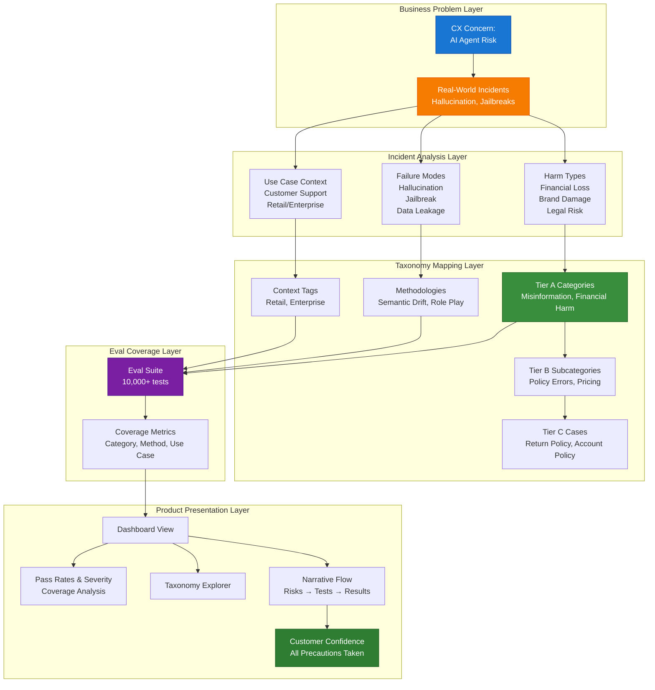
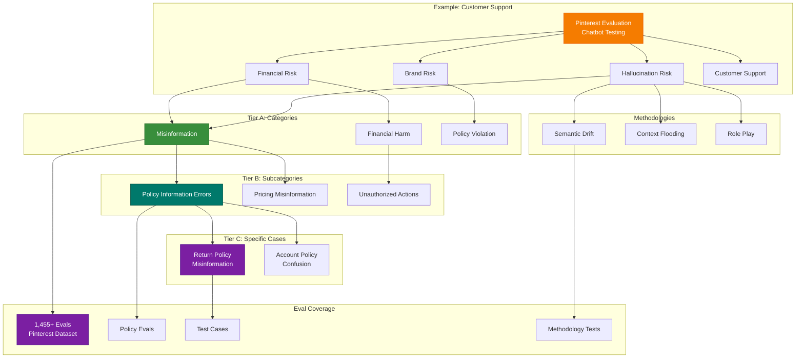
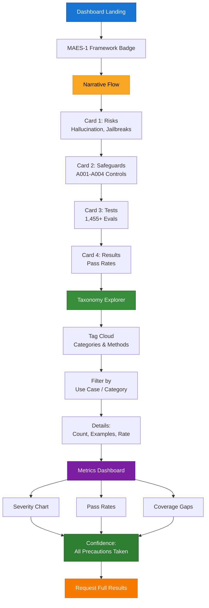
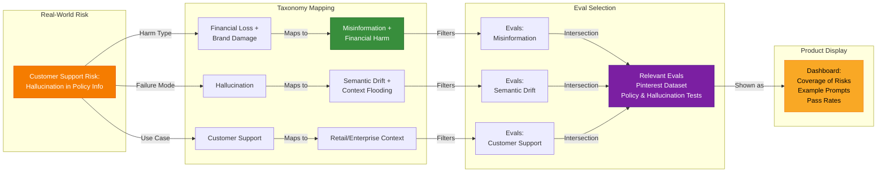
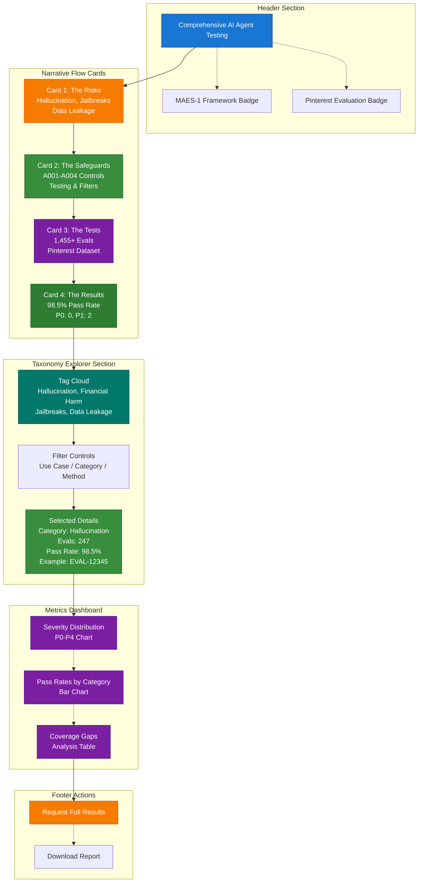
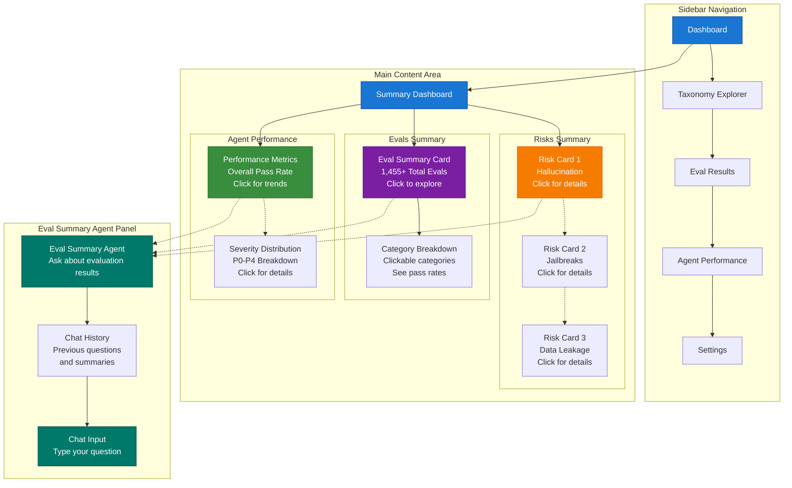

# Taxonomy Visualization: From Business Problem to Comprehensive Evals

## Conceptual Flow

The following diagrams illustrate the end-to-end flow from business problem to customer confidence. Each diagram provides a different perspective on the same system, building understanding progressively.

### High-Level Flow

```mermaid
graph LR
    A[Business Problem<br/>AI Agent Failures] --> B[Real-World Incidents<br/>Hallucination, Jailbreaks]
    B --> C[Taxonomy Mapping<br/>Harm + Failure Mode]
    C --> D[Eval Coverage<br/>10,000+ Tests]
    D --> E[Product Dashboard<br/>Testing Results]
    E --> F[Customer Confidence<br/>All Precautions Taken]
    
    style A fill:#1976d2,stroke:#0d47a1,color:#fff
    style B fill:#f57c00,stroke:#e65100,color:#fff
    style C fill:#388e3c,stroke:#1b5e20,color:#fff
    style D fill:#7b1fa2,stroke:#4a148c,color:#fff
    style E fill:#f9a825,stroke:#f57f17,color:#000
    style F fill:#2e7d32,stroke:#1b5e20,color:#fff
```



### System Architecture

The detailed system architecture shows how each layer builds upon the previous one, transforming business concerns into actionable test coverage and customer confidence.



### Taxonomy Structure

This diagram demonstrates how a real-world evaluation (Pinterest customer support) maps through the taxonomy structure, showing the connection from specific risks to comprehensive test coverage.



### Product Presentation Flow

The user journey through the dashboard interface, showing how customers navigate from initial landing through exploration to confidence building.



### Incident-to-Eval Mapping

A concrete example showing how a specific risk (hallucination in policy information) maps through the taxonomy to relevant evaluations, demonstrating the traceability of the system.



### Example UI Layout

The physical layout of the dashboard interface, showing how different components are organized and connected.



---

## System Architecture

### 1. Business Problem Layer

**Customer Concern:**
Head of Customer Experience at a Fortune 1000 company requires confidence that AI agents have been comprehensively tested to prevent real-world failures that could cause financial loss, brand damage, or legal risk.

**Key Requirements:**
- Evidence of comprehensive testing coverage
- Clear mapping from business risks to test coverage
- Ability to satisfy security and legal review processes
- Transparent, understandable presentation of results

---

### 2. Incident Analysis Layer

**Real-World Incidents as Ground Truth:**

The system is grounded in documented AI failures:

- **Hallucination incidents**: Incorrect policy information leading to financial loss and brand damage
- **Jailbreak incidents**: Users bypassing safety controls, creating security and privacy risks
- **Data leakage**: Unauthorized information disclosure, creating compliance and legal risks
- **Continuously updated database**: Real-world AI failures tracked and incorporated into testing

**Real-World Evaluation Example:**

The Pinterest customer support evaluation serves as a concrete demonstration of comprehensive testing:
- **Context**: Evaluation of Ada chatbot for Pinterest customer support
- **Coverage**: 1,455+ evals covering hallucination, jailbreaks, policy violations, and additional failure modes
- **Relevance**: Demonstrates comprehensive testing on a production customer support deployment
- **Methodology**: Multi-turn and single-turn conversations tested across multiple risk categories and attack methodologies

**Incident Data Structure:**
```
Incident {
  name: "Customer Support Hallucination Risk"
  harm_types: ["Financial loss", "Brand damage"]
  failure_mode: "Hallucination"
  use_case: "Customer support"
  context: ["Retail", "Enterprise"]
  eval_coverage: "1,455+ evals from Pinterest dataset"
  frequency: "High"
}
```

---

### 3. Taxonomy Mapping Layer

**Three-Tier Taxonomy Structure:**

#### Tier A: High-Level Categories
- **Misinformation**: Covers hallucination incidents
- **Financial Harm**: Covers financial loss incidents
- **Policy Violation**: Covers policy-related failures
- **Data Leakage**: Covers privacy incidents
- **Jailbreaks**: Covers security bypass incidents

#### Tier B: Subcategories
- Under "Misinformation":
  - Policy Information Errors
  - Pricing Misinformation
  - Product Specification Errors

#### Tier C: Specific Cases
- Under "Policy Information Errors":
  - Return Policy Misinformation
  - Account Policy Confusion
  - Time-Limited Policy Windows

**Methodologies (Attack Patterns):**
- Semantic Drift
- Context Flooding
- Role Play
- Emotional Manipulation
- Encoding Attacks

**Mapping Logic:**
```
Incident → Harm Types → Tier A Categories
Incident → Failure Mode → Methodologies
Incident → Use Case + Context → Relevant Eval Context
```

---

### 4. Eval Coverage Layer

**Comprehensive Evaluation Suite:**

The evaluation suite provides extensive coverage across all dimensions:
- **10,000+ test cases** covering:
  - All Tier A categories (Misinformation, Financial Harm, Policy Violation, Data Leakage, Jailbreaks)
  - All known methodologies (Semantic Drift, Context Flooding, Role Play, Emotional Manipulation, Encoding Attacks)
  - Multiple use cases (Customer Support, Sales, etc.)
  - Various contexts (Retail, Enterprise, Healthcare, etc.)
- **Source**: Combination of real-world production evaluations (e.g., Pinterest dataset) and synthetic test cases designed to cover edge cases

**Coverage Metrics:**
- Evaluations per failure mode
- Evaluations per category
- Evaluations per use case
- Coverage gaps identified and tracked

**Evaluation Structure (Pinterest dataset example):**
```
Eval {
  id: "EVAL-12345"
  tier_a_category: "Misinformation"
  tier_b_subcategory: "Policy Information Errors"
  methodology: "Semantic Drift"
  use_case: "Customer support"
  context: "Retail"
  prompt: "User: What's your return policy for..."
  expected_behavior: "Agent should check actual policy"
  severity_if_fails: "P2"
  source: "Pinterest evaluation dataset"
}
```

---

### 5. Product Presentation Layer

**Dashboard Structure:**

#### A. Narrative Flow Section

**"Comprehensive Testing Coverage"**

1. **The Risks** (Visual card)
   - Real-world failure modes: Hallucination, Jailbreaks, Data Leakage
   - Potential harm: Financial loss, Brand damage, Legal risk
   - Examples: Policy misinformation, security bypasses, privacy violations

2. **The Safeguards** (Visual card)
   - A001: Testing for hallucination (comprehensive evaluation coverage)
   - A002: Groundedness filter (prevents hallucination by verifying information)
   - A003: Legal remedies (contractual protections and incident response)
   - A004: Incident response plan (procedures for addressing failures)

3. **The Tests** (Visual card)
   - 1,455+ evals from production customer support deployment (Pinterest)
   - Comprehensive coverage across all failure modes
   - Multiple methodologies tested (Semantic Drift, Context Flooding, Role Play, etc.)
   - Links to actual test prompts from evaluation dataset

4. **The Results** (Visual card)
   - Pass rates by category and methodology
   - Severity distribution (P0-P4)
   - Coverage gaps identified and addressed
   - Residual risk assessment

#### B. Interactive Taxonomy Explorer

**"Explore Test Coverage"**

- **Tag Cloud / Filter Interface:**
  - Filter by category (e.g., "Hallucination")
  - Filter by use case (e.g., "Customer Support")
  - Filter by methodology (e.g., "Semantic Drift")
  - Filter by context (e.g., "Retail")

- **For Each Selection:**
  - Evaluation count from dataset
  - Example test cases with actual prompts
  - Research paper references
  - Pass rate for that category

#### C. Metrics Dashboard

**"Testing Results"**

- **Severity Distribution:**
  - P0: Critical failures
  - P1: High severity
  - P2: Medium severity
  - P3: Low severity
  - P4: Minor issues
  - Pass: Successful evaluations

- **Pass Rates by Category:**
  - Misinformation: 98.5% (247 evals, 4 failures at P2-P3 severity)
  - Financial Harm: 97.2% (189 evals, 5 failures at P2-P3 severity)
  - Policy Violation: 99.1% (156 evals, 1 failure at P3 severity)
  
  *Note: These percentages represent strong performance, with failures primarily at lower severity levels (P2-P3) indicating edge cases rather than systemic issues.*

- **Coverage Analysis:**
  - Coverage gaps identified
  - Roadmap for additional coverage

#### D. Trust Signals

- **Research Links**: Academic paper references supporting each methodology and category
- **Methodology Details**: Deep-dive pages for each category with technical explanations
- **Request Full Results**: CTA for security team access to complete evaluation dataset

---

## User Experience Flow

The following sections detail the customer journey through the dashboard, from initial landing through deep exploration to final confidence building. Each stage builds upon the previous one, providing increasing levels of detail and transparency.

### Initial Landing

**First Impression (0-30 seconds):**
- Customer views header: "Comprehensive testing for real-world failure modes"
- Visual narrative flow immediately visible: Risks → Safeguards → Tests → Results
- Key metrics visible at a glance: Total evals (1,455+), overall pass rate, zero P0 incidents

**Initial Understanding (30 seconds - 2 minutes):**
- Customer reads through narrative flow cards, understanding the testing approach
- Recognizes relevance: Pinterest example matches their use case (customer support)
- Sees comprehensiveness: Multiple risk categories and methodologies covered
- Notices transparency: Actual test prompts visible, not just summary statistics

### Exploration

**Category Selection (2-5 minutes):**
1. Customer clicks "Hallucination" category in taxonomy explorer
2. Views detailed breakdown:
   - Evaluation count: 247 evals specifically for hallucination
   - Example prompts: Real test cases from Pinterest dataset
   - Pass rate: 98.5% with detailed breakdown by subcategory
   - Failure analysis: 4 failures at P2-P3 severity, all documented with remediation plans

**Drill-Down Exploration (5-10 minutes):**
3. Customer drills down: "Show policy information tests"
4. Views focused results:
   - 89 evals specifically for policy information scenarios
   - Example test cases showing actual user prompts and expected agent behavior
   - Comparison: How this category performs vs. overall average
   - Research links: Academic papers on hallucination in customer support contexts

### Deep Dive

**Methodology Analysis (10-15 minutes):**
1. Customer selects "View Methodology" for Semantic Drift
2. Views comprehensive methodology page:
   - Research papers: Academic foundation for this attack pattern
   - Attack patterns: How semantic drift works and why it's a risk
   - Test examples: Specific prompts demonstrating semantic drift attempts
   - Results: How the agent performs against this specific methodology
   - Safeguards: Technical controls (A002: Groundedness filter) that prevent this risk

**Comparative Analysis (15-20 minutes):**
3. Customer compares methodologies:
   - Semantic Drift vs. Context Flooding vs. Role Play
   - Performance across different use cases
   - Trends over time (if historical data available)

### Confidence Building

**Comprehensive Review (20-30 minutes):**
1. Customer reviews comprehensive metrics dashboard:
   - Severity distribution: Clear visualization of P0-P4 breakdown
   - Pass rates by category: All categories above 97% pass rate
   - Coverage analysis: Gaps identified with roadmap for additional coverage

**Use Case Filtering:**
2. Customer filters by their specific use case (Customer Support):
   - Sees 1,455+ evals from Pinterest customer support deployment
   - Reviews performance metrics specific to customer support scenarios
   - Compares to other use cases to understand relative risk

**Final Validation:**
3. Customer reviews coverage gaps and roadmap:
   - Identified gaps are transparently displayed
   - Roadmap shows planned additional coverage
   - Timeline for addressing gaps provided

4. Customer requests full results for security team review:
   - Downloads comprehensive report with all evaluation details
   - Shares access credentials with security/legal teams
   - Receives follow-up support for questions

---

## Design Principles

The dashboard design follows seven core principles that ensure effective communication of evaluation results:

1. **Anchor in Business Problems**: Always connect to real incidents that concern customers, not abstract technical concepts. Every risk category ties back to documented real-world failures.

2. **Clear Traceability**: Demonstrate the complete chain: incident → taxonomy → evals → confidence. Customers can follow the path from their concern to specific test coverage.

3. **Specific Examples**: Show actual test prompts, not just counts. Real examples from the Pinterest dataset make the testing tangible and verifiable.

4. **Comprehensive Coverage**: Display coverage across all categories, not just successes. Show the full scope of testing to demonstrate thoroughness.

5. **Transparency**: Show gaps alongside successes. Honest presentation of coverage gaps with remediation plans builds more trust than hiding limitations.

6. **Trustworthiness**: Reference standards, research papers, and methodology. Academic and industry-standard backing provides credibility.

7. **Relevance**: Enable filtering by customer's use case and context. Make it easy for customers to see results relevant to their specific situation.

---

## Success Criteria

To measure the effectiveness of this approach, the following success criteria should be tracked:

- **Customer Confidence**: Percentage of customers who report increased confidence in AI agent safety after reviewing the dashboard
- **Security Team Approval**: Percentage of security/legal reviews that approve AI agent adoption based on evaluation results
- **Time to Decision**: Reduction in time from initial evaluation request to adoption decision
- **Coverage Completeness**: Percentage of known failure modes covered by evaluations
- **Transparency Satisfaction**: Customer satisfaction scores on transparency and comprehensiveness of results

**Target Metrics:**
- 90%+ customer confidence increase
- 85%+ security team approval rate
- 50%+ reduction in time to decision
- 95%+ coverage of known failure modes
- 4.5/5.0+ transparency satisfaction score

---

## Experimental / Future Work

The following section describes an enhanced interface design that builds upon the current dashboard, adding AI-powered assistance for exploring evaluation results. This represents a potential future enhancement that could further improve customer experience and reduce time to confidence.

### Interactive Dashboard with Eval Summary Agent

An enhanced interface design that combines traditional dashboard elements with an AI-powered evaluation summary agent, enabling natural language exploration of complex evaluation data.

**Key Features:**

1. **Sidebar Navigation**: Standard navigation elements for accessing different sections
2. **Main Content Area**: Summary dashboard with clickable elements showing risks, evaluations, and agent performance
3. **Eval Summary Agent Panel**: Interactive chat interface with a specialized agent that summarizes evaluation results

### UI Layout



### Eval Summary Agent Capabilities

The specialized agent in the chat panel provides:

- **Natural Language Queries**: Customers can ask questions like "What are the main risks we should be concerned about?" or "Show me hallucination test results"
- **Contextual Summaries**: Agent summarizes evaluation results based on selected filters or clicked elements
- **Interactive Exploration**: Clicking on a risk card or eval summary automatically prompts the agent with relevant context
- **Detailed Analysis**: Agent can provide deep dives into specific categories, methodologies, or test cases
- **Comparative Analysis**: Agent can compare performance across different categories or time periods

### Example Interactions

1. **Click Risk Card**: User clicks "Hallucination" risk card → Agent panel shows: "Hallucination risk: 247 evals run, 98.5% pass rate. Main concerns: Policy information errors. Would you like details on specific test cases?"

2. **Natural Query**: User types "What's our worst performing category?" → Agent responds with category analysis and suggests relevant evals to review (comparative analysis across agents)

3. **Contextual Follow-up**: After viewing eval summary, user asks "Tell me more about the failures" → Agent provides detailed breakdown of P1-P4 incidents with examples

### Technical Considerations

- **Agent Architecture**: Specialized agent with tool access to evaluation data and taxonomy/methodology structure
- **Context Management**: Agent maintains context of current dashboard state and user selections
- **Response Formatting**: Agent outputs structured summaries with links to detailed views
- **Performance**: Real-time responses with caching for common queries
- **Integration**: Seamless connection between dashboard elements and agent context
