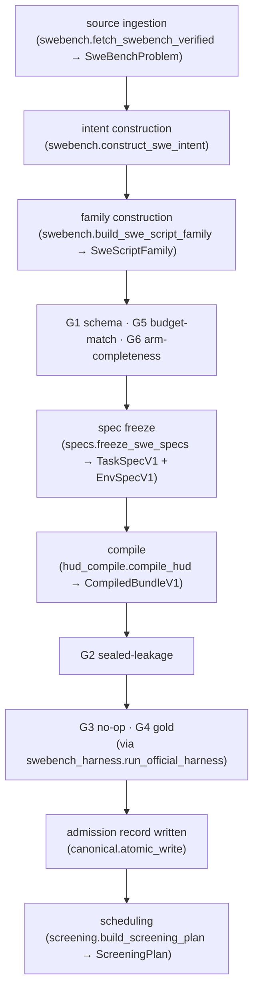

# Admission QC: gate specifications and the judgment-review split

The upstream design audit
([PR #21](https://github.com/nikhil-vytla/hatch/pull/21), Q2) surveyed how
task-generation efforts actually do QC and recommended a split: mechanically
checkable admission gates in code, and a Cursor skill for the judgment calls.
Its dividing line, adopted here verbatim:

> If a check can be wrong in a way a regression test would catch, it is
> code; if a check can only be wrong in a way a reviewer argues about, it
> is a skill.

This folder delivers both halves' specifications: distilled best practices
from the open-source task-quality literature (§1), precise specifications
for six in-code admission gates against the PR #20 branch's actual types
(§2), and the design rationale for the judgment-side skill that ships in
this same PR at `parallax/.cursor/skills/review-task-admission/` (§3).

The gates are **specifications, not code** — implementation belongs to the
`parallax/src` owner on the PR #20 branch
(`cursor/parallax-screening-run`), which this unit deliberately does not
touch. All module and type names below were read from that branch
(read-only, base commit `5984ce4` plus in-flight changes, 2026-08-02) so
the implementer can build without redesign.

## Sources

| Source | What was used | How consulted |
|---|---|---|
| [METR Task Development Guide](https://taskdev.metr.org/) — Desiderata, Quality Assurance | reviewer independence; invalid/partial/best solution score probes; "not difficult for incidental reasons"; scoring tolerant of format noise | full pages, 2026-08-02 |
| [HUD "Designing tasks"](https://docs.hud.ai/v6/reference/advice) | cheapest-path principle; four-way leakage taxonomy; prompt–grader alignment; same-shape taskset diagnostic | full page, 2026-08-02 |
| [slop-code-bench contributing checklists](https://github.com/SprocketLab/slop-code-bench/tree/main/docs/contributing-problems) (`checklist.md`, `review-checklist.md`) | "could two correct implementations differ?"; what-not-how leakage rules; deliberate under-specification of error text | raw files, repo `main`, 2026-08-02 |
| [Prime Intellect verifiers v1 GUIDE](https://github.com/PrimeIntellect-ai/verifiers/blob/main/verifiers/v1/GUIDE.md) + [Environments Hub docs](https://docs.primeintellect.ai/verifiers/overview) | shipped model-free `validate` gold check; per-task error isolation ("one bad task is data, not a crash"); Hub no-op + flaky-retry practice (via audit Q2) | GUIDE full text, 2026-08-02 |
| [SWE-smith validation docs](https://swesmith.com/guides/harnesses/) + [paper](https://proceedings.neurips.cc/paper_files/paper/2025/file/8b86cf5ace600c48fd188efbb8dedec8-Paper-Datasets_and_Benchmarks_Track.pdf) | pre/post-patch F2P validation; runtime cap; per-candidate evidence folder; the unvalidated-issue-text cautionary tale | docs + paper §2, 2026-08-02 |
| [Anthropic, "Demystifying evals for AI agents"](https://www.anthropic.com/engineering/demystifying-evals-for-ai-agents) | grader taxonomy; two-experts ambiguity test; 0%-pass-means-broken-task triage prior; "read the transcripts" | full text, 2026-08-02 |
| [METR Task Standard](https://github.com/METR/task-standard) | in-environment pytest pattern asserting scores of known-good and known-incorrect solutions | README, 2026-08-02 |
| Parallax upstream design audit ([PR #21](https://github.com/nikhil-vytla/hatch/pull/21)) | Q2 survey table and code/skill split; evolving-intent App. D semantics; SWE-Gym summary | branch `research/upstream-design-audit`, commit `a1fbe6b` |
| PR #20 branch `cursor/parallax-screening-run` | all module/type names in §2 | read-only worktree, 2026-08-02 |

OpenAI was searched for a current eval-authoring guide comparable to
Anthropic's; their present evals documentation is API/product reference,
not authoring guidance, so it is not cited.

---

## 1 — Distilled best practices

Seven findings, each with the practice it implies for Parallax.

**1. Anchor admission on executable checks with known answers, in both
directions.** Every serious code-task effort admits on execution: SWE-smith
keeps only candidates that break ≥1 previously-passing test; SWE-Gym keeps
only instances whose gold patch improves the test outcome; Prime Intellect
ships `uv run validate` as a model-free gold check and its Hub practice adds
the no-op direction (task must fail with zero edits). METR's "pre-validated
tasks" alternative asks authors to submit an invalid, a partial, and a best
solution and confirm each score. The bidirectional pair — gold must pass,
no-op must fail — bounds both false negatives (broken reference) and false
positives (vacuous task). *Implication: gates G3/G4 below are the admission
bar; nothing semantic substitutes for them.*

**2. Separate flaky from broken; never retry a verdict.** Prime Intellect's
Hub validation retries up to 10 times to separate flaky infrastructure from
broken tasks, and its `validate` CLI treats a raised error as a data row
(`valid`/`invalid`/`timeout`/`error`), not a crash. The generalization: an
infrastructure failure (`RunFailure`) is retryable evidence; a graded WRONG
is deterministic evidence, and retrying it is shopping for flakiness.
*Implication: G4's retry policy retries only run failures, bounded, and
records `admitted_flaky` when a retry was needed.*

**3. The cheapest path must sit at or below the floor.** HUD's task-design
page states the single most important grader property: "the highest reward
an agent can get without doing the work the task is about must sit at or
below the floor," with concrete exploit patterns (hardcoded outputs,
symptom-mitigation instead of root-cause fixes, grader-vocabulary echoing).
METR's desiderata say cheating "should be prevented by technical measures,"
not review. The no-op gate is the mechanical floor check; whether an agent
can pass *without experiencing the evolution* (the audit's Q3 concern) is
its multi-turn analogue and is a judgment question. *Implication: G3 in
code; skill question 4 for the paths no fixed probe can enumerate.*

**4. Leakage is broader than verbatim bytes.** The branch's
`sealed_fragments` lint catches literal test names, hunk lines, and patch
text. HUD's taxonomy names three more kinds a lint cannot catch:
root-cause leakage (prose that names the fix), grader leakage (prompt
vocabulary that exists only to satisfy the verifier), and eval-context
leakage (text implying the task is a test). slop-code-bench's review rules
add structural leakage — specs that prescribe *how* rather than *what*
("no design-pressure paragraphs"). *Implication: the mechanical lint (G2)
is necessary but not sufficient; paraphrase-level leakage is skill
question 3.*

**5. Ambiguity has an operational test.** slop-code-bench: "Could two
correct implementations produce different outputs?" Anthropic: success
criteria "two domain experts would grade identically." Both are the same
test at different layers, and both efforts treat *deliberate*
under-specification (exact error strings, internal architecture) as
correct — reviewers must not manufacture false ambiguity by demanding
everything be pinned. *Implication: skill question 1, with the
false-ambiguity caveat stated.*

**6. Naturalness and incidental difficulty are review-only properties.**
METR: tasks "shouldn't be weird or confusing in a way that might unfairly
throw the agent off" and shouldn't be difficult for incidental reasons.
SWE-smith's paper concedes its generated issue text got *no* checks for
under-specification or solution leakage — the audit flags this as exactly
the hole a rendered-turn review closes. HUD's same-shape diagnostic ("if
you can summarize every task with one sentence varying only the nouns") is
the family-level version. *Implication: skill question 2, asked over
rendered turns, never internal state.*

**7. Triage failures before reacting to them; read transcripts.**
Anthropic: a 0% pass rate usually points at a broken task or grader, not
an incapable model, and only transcripts reveal which. The evolving-intent
viability lesson (audit Q2): rejecting sources non-uniformly mid-pipeline
silently changes the population between arms. *Implication: gate evidence
must be rich enough to triage from (G-records below), and skill question 5
asks whether a proposed fix changes the population selectively.*

---

## 2 — Gate specifications (in-code half)

### Pipeline placement

The construction→admission→scheduling pipeline on the PR #20 branch, with
gates inserted (existing functions in parentheses; `parallax.` prefix
omitted):



G1/G5/G6 are cheap and run per candidate family immediately after
construction. G2 runs on the compiled bundle (it must see what the agent
will actually see). G3/G4 need the pinned container and run last — they are
the expensive gates, and there is no point paying for them on a family that
already failed a cheap gate. All gates must pass before
`screening.build_screening_plan` freezes the `DesignDigest`; a source
without an admission record must not appear in `ScreeningPlan.sources`.

The natural home is a new module `parallax/src/parallax/admission.py`,
depending only on existing modules (`specs`, `hud_compile`,
`swebench_harness`, `outcome`, `canonical`, `types`).

### Evidence model

One record per gate execution, one admission record per candidate family.
Suggested shapes, composing existing types (`StrictModel`, `DigestText`
from `types.py`; `Outcome` from `outcome.py`):

```python
GateName = Literal[
    "schema", "sealed_leakage", "noop", "gold", "budget_match", "arm_completeness"
]


class GateResultV1(StrictModel):
    gate: GateName
    passed: bool
    evidence: str  # human-readable, sealed-clean (see G2)
    attempts: tuple[Outcome, ...] = ()  # execution gates only
    report_digests: tuple[DigestText, ...] = ()


class AdmissionRecordV1(StrictModel):
    schema_version: Literal[1] = 1
    source_id: SourceId
    spec_digest: DigestText  # TaskSpecV1.spec_digest
    environment_digest: DigestText  # EnvSpecV1.digest
    bundle_digest: DigestText  # canonical_digest(CompiledBundleV1)
    gates: tuple[GateResultV1, ...]  # all six, in pipeline order
    decision: Literal["admitted", "admitted_flaky", "rejected"]
```

Written with `canonical.atomic_write` beside the screening evidence
(pattern: `screening.run_screening`'s append-fsync JSONL). Rejections are
retained, not deleted — Prime Intellect persists exclusions for public
audit, and rejected records are what the skill's triage reads.
Per-gate isolation follows the verifiers `validate` contract: a gate that
*errors* produces a failed `GateResultV1` with the error as evidence; it
never crashes the admission run for the other candidates.

### The gates

Each gate: name, input, pass/fail predicate, failure evidence recorded,
pipeline seat.

---

**G1 — schema validity**

- **Input:** the candidate `SweScriptFamily`, and the frozen
  `TaskSpecV1` + `EnvSpecV1` from `freeze_swe_specs`.
- **Predicate:** pass iff a canonical round-trip re-validates: for each
  object, `type(obj).model_validate_json(canonical_bytes(obj))` succeeds
  and the result's `canonical_digest` equals the original's. This
  re-executes every `model_validator` on `StrictModel` subclasses
  (`SweScriptFamily.controlled_family`, `PublicTaskV1.controlled_arms`,
  `SweScript.aligned_budget`, …) against the serialized form that will
  actually be stored and shipped.
- **Failure evidence:** the first `ValidationError` message
  (`error.errors(include_url=False)[0]["msg"]`, the codebase's existing
  convention) and the field path; or the pair of digests on a round-trip
  digest mismatch.
- **Seat:** immediately after `build_swe_script_family` +
  `freeze_swe_specs`, before compile.
- Rationale: constructors validate in memory, but admission is a claim
  about the *persisted* artifact; the round-trip catches
  serialization-boundary drift that in-memory construction cannot.

---

**G2 — sealed-leakage lint**

- **Input:** `TaskSpecV1.sealed` (`SealedAuthorityV1`) and the compiled
  `CompiledBundleV1.agent_artifacts` — the compiled surface, not just the
  script turns, because agent artifacts are what the agent actually reads.
- **Predicate:** pass iff `hud_compile.assert_agent_artifacts_clean(task.sealed,
  bundle.artifacts)` does not raise `SealedLeakError`. The fragment set is
  `hud_compile.sealed_fragments`: full `test_patch`, every
  `fail_to_pass`/`pass_to_pass` name, hunk headers, added lines ≥4 chars,
  and added `test_*` function names.
- **Failure evidence:** the artifact `path`, the *digest* and byte-length
  of the matched fragment — **never the fragment itself**. Admission
  records get read into agent and reviewer contexts; quoting the sealed
  fragment in evidence would make the record a new leakage surface.
  (Requires a small extension to `assert_agent_artifacts_clean` or a
  wrapper that reports which fragment matched, since the current
  `SealedLeakError` message names only the path.)
- **Seat:** immediately after `compile_hud`, before any container work.
- Note: this lint is byte-level by design. Paraphrase-level leakage
  (root-cause prose, grader vocabulary, eval-context tells — HUD's
  taxonomy) is not mechanically checkable and belongs to the skill.

---

**G3 — no-op check** (task must fail with zero edits)

- **Input:** `TaskSpecV1` + `EnvSpecV1`; executes in the pinned container
  via `swebench_harness.run_official_harness`.
- **Predicate:** submit an **identity patch** — a syntactically valid,
  semantically inert diff that applies cleanly (e.g. appending a blank
  line to a file the tests never import). Pass iff the resulting
  `HarnessEvaluation` has `outcome.verdict != Verdict.PASS` **and**
  `fail_to_pass_success == ()` **and** the report shows
  `patch_successfully_applied == True`.
- **Why not an empty patch:** `run_official_harness` maps an empty
  `model_patch` to `patch_exists=False` and returns WRONG *without
  executing any tests* — a naive "empty submission must fail" check passes
  vacuously and certifies nothing. The identity patch forces actual test
  execution, so the gate observes the F2P tests genuinely failing on the
  unmodified tree (SWE-smith's pre-gold baseline run, expressed through
  the official harness).
- **GSM8K analogue:** `gsm8k.grade(problem, "")` and
  `grade(problem, f"FINAL_ANSWER: {wrong}")` must not return
  `Verdict.PASS` (the empty case returns INVALID today; the gate asserts
  it stays that way).
- **Failure evidence:** the full `HarnessEvaluation` (report digest,
  `fail_to_pass_success`, `pass_to_pass_success`), the identity patch
  digest, and the verdict. A failure here means the task is solvable with
  zero edits — the F2P tests already pass — and the source must be
  rejected, not patched.
- **Seat:** after G2, sharing container setup with G4 (same image pull,
  run G3 first — it is cheaper to interpret).

---

**G4 — gold check** (reference must pass, with flaky-retry)

- **Input:** `TaskSpecV1` + `EnvSpecV1` + the source gold patch;
  executes via `run_official_harness(task, environment, gold_patch, ...)`.
- **Schema prerequisite (the one change to existing types):** the gold
  patch is parsed today (`swebench._DatasetRow.patch`) but dropped —
  neither `SweBenchProblem` nor `SealedAuthorityV1` carries it. The
  implementer must thread it through as sealed material
  (`SweBenchVerifier.gold_patch: NonEmptyText` and
  `SealedAuthorityV1.gold_patch: NonEmptyText` are the natural seats;
  `sealed_fragments` should then also mine it, which strengthens G2).
- **Predicate:** pass iff `HarnessEvaluation.outcome.verdict ==
  Verdict.PASS` within at most 3 attempts, where a retry is permitted
  **only** after an infrastructure failure (`OfficialHarnessError` /
  `RunFailure`) — a graded `Verdict.WRONG` is terminal and fails the gate
  on the spot. Verdicts are deterministic evidence; retrying one is
  shopping for flakiness.
- **Classification:** pass on attempt 1 → `admitted`; pass after ≥1 infra
  failure → `admitted_flaky` (recorded in `AdmissionRecordV1.decision`,
  Prime Intellect's flaky/broken separation with a budget of 3 instead of
  their 10 — each attempt here is a full container evaluation, and an
  environment needing more than 3 tries is itself broken); all attempts
  exhausted or WRONG → `rejected`.
- **GSM8K analogue:** `grade(problem, f"FINAL_ANSWER: {problem.answer}")`
  must return `Verdict.PASS` (deterministic — no retry needed).
- **Failure evidence:** every attempt's `Outcome` in order
  (`GateResultV1.attempts`), every `report_digest`,
  `fail_to_pass_success` of the last attempt (which F2P tests the gold
  patch failed to fix), `harness_revision`, `image_digest`.
- **Seat:** after G3, same container session. G3+G4 together are the
  bidirectional pair the audit called the field's state of the art.

---

**G5 — budget matching**

- **Input:** the candidate `SweScriptFamily` (or `PublicTaskV1`) and
  `EnvSpecV1`.
- **Predicate:** pass iff (a) all three arms share one
  `(total_agent_steps, max_output_tokens)` pair; (b)
  `len(matched.turns) == len(evolved.turns)`; (c) the per-turn allocations
  `agent_steps` of matched and evolved are equal element-wise; and (d) the
  environment budget equals the arm budget
  (`EnvSpecV1.budget.total_agent_steps == static.total_agent_steps`, same
  for tokens). (a), (b), (d) re-assert existing validators
  (`SweScriptFamily.controlled_family`, `compile_hud`'s budget check);
  (c) is new — `controlled_family` currently compares totals and turn
  counts but not the per-turn step split, and an unequal split is exactly
  the upstream SWE budget confound the audit's Q1 refused to inherit.
- **Failure evidence:** the offending per-arm tuples, verbatim (they are
  public material).
- **Seat:** with G1, immediately after construction — it needs no
  container and any failure is a constructor bug.

---

**G6 — arm-completeness (simulation viability)**

- **Input:** the construction attempt for one source: either a
  `SweScriptFamily` or the `SweBenchError`/`ConstructionError` that
  aborted `construct_swe_intent`/`build_swe_script_family`, plus the
  planned arm set for the experiment.
- **Predicate:** pass iff construction produced a complete family — every
  planned arm present with ≥1 turn (`SweScriptFamily.controlled_family`
  guarantees the three-arm shape when the object exists; the gate's job is
  to catch the *doesn't-exist* case and make it a recorded rejection
  rather than a silent skip).
- **Failure evidence:** the construction exception message plus the
  retained `GenerationAttempt` tuple (for the GSM8K path,
  `evolving_intent.ScriptFamily.attempts` already records model, output,
  and rejection reason per attempt; the SWE path's
  `SweConstructionEvidence` is the analogue).
- **Seat:** wraps construction itself; the earliest gate.
- Rationale (audit Q2, the evolving-intent 23-config lesson): sources that
  fail construction for *some* arms but are admitted for others silently
  change the population between conditions and invalidate the paired
  design. Rejection must be per-source, uniform across arms, and recorded
  — so the skill's triage can later ask whether the rejections are
  selective (e.g. all multi-argument sources failing predecessor
  generation would bias the admitted population toward trivial
  evolutions).

---

### What is deliberately *not* a gate

- **LLM-judge checks** (counterfactual minimality, predecessor
  plausibility — evolving-intent App. D semantics). Both the audit and
  `docs/methods/checkpoint-evolution.md` hold that rubric judgments are
  excluded from admission. They may run as below-the-bar evidence
  (majority-voted, transcripts retained) but never flip
  `AdmissionRecordV1.decision`.
- **Conformance** (`conformance.run_conformance`). It answers a different
  question — does the *compiled grader* agree with the reference grader on
  the fixed submission set — and stays its own record
  (`ConformanceRecordV1`). A conformance failure is a compiler bug, not a
  task rejection; conflating the two records would misfile it.
- **Ambiguity, naturalness, paraphrase leakage, cheapest-path review.**
  These can only be wrong in ways a reviewer argues about → the skill.

---

## 3 — The judgment half: `review-task-admission` skill

Ships in this PR at
[`parallax/.cursor/skills/review-task-admission/`](../../.cursor/skills/review-task-admission/SKILL.md).
Design decisions, per the approval constraints:

- **Judgment prompts, not checklists.** The five core questions (ambiguity,
  naturalness, paraphrase leakage, cheapest path, failure triage) are
  phrased as questions with the evidence worth looking at, not as
  checkboxes. The slop-code-bench checklists were mined for their
  *questions*; their 50-checkbox format was deliberately not copied — the
  skill states that a review that finds nothing wrong should say so in
  three sentences, not produce a filled-out form.
- **Rendered turns, not internal state.** The reviewer reads what the agent
  will read: `PublicScriptV1.turns` / `CompiledBundleV1.agent_artifacts`,
  in delivery order, per arm. Internal intents, schedules, and sealed
  authority are out of bounds for the first pass — METR's QA independence
  rule (the reviewer sees only what the agent sees) applied to an agent
  reviewer. Sealed material may be consulted only afterward, for leakage
  adjudication, and never quoted into the verdict.
- **Three invocation triggers:** new generated task family, gate-failure
  triage (reading `AdmissionRecordV1` rejections), pre-experiment spot
  check of a sample from an admitted population.
- **Verdicts are recorded** as short markdown in the family's research
  folder with identity digests (`spec_digest`, `bundle_digest`), a
  decision (`admit` / `admit-with-notes` / `reject`), and at least one
  observation tied to a specific rendered turn. A minimal validator
  (following the `distill-research-learnings` validator pattern) checks
  only these mechanical properties — it validates the record's shape,
  never the judgment.

---

## Reproduction

```bash
# the branch state the gate specs were written against
git -C /Users/nikhil/work/hatch log origin/cursor/parallax-screening-run --oneline -1
# audit this unit executes (read its Q2)
git -C /Users/nikhil/work/hatch show origin/research/upstream-design-audit:parallax/research/upstream-design-audit/README.md
# skill validator self-test
python3 parallax/.cursor/skills/review-task-admission/scripts/test_validate_verdict.py
```

External sources: URLs in the table above, all fetched 2026-08-02.

## Claim limits

- The gate predicates were checked against the PR #20 branch *as read on
  2026-08-02*; that branch is under active rewrite, and names may drift
  before implementation. The pipeline seats and evidence model are stable
  against such drift; the exact validator names may not be.
- The identity-patch requirement in G3 is derived from reading
  `run_official_harness`'s short-circuit, not from executing it; the
  implementer should confirm with one live run that an identity patch
  yields `patch_successfully_applied=True` on a representative instance.
- No gate has been executed. This document claims the specifications are
  precise enough to implement without redesign, not that they have run.

## Next falsifiable experiment

Implement G3+G4 only, and run them over the 10 `INITIAL_SCREENING_IDS`
sources in `swebench.py`. **Pass:** all 10 gold patches admit (SWE-bench
Verified is human-validated, so a rejection would indicate our harness
wiring, not the data) and all 10 no-op checks fail the identity patch.
**Fail:** any gold rejection or vacuous no-op pass — either finding means
the pipeline, not the dataset, needs fixing before any screening result is
interpretable.
